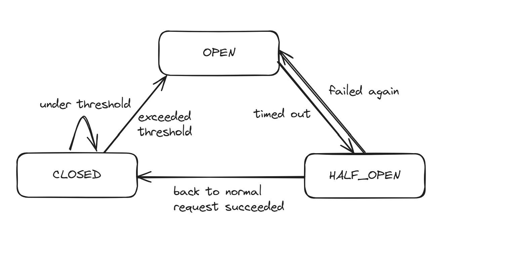

# Microservice-CircuitBreaker-Practice
마이크로서비스에서 발생할 수 있는 문제를 서킷 브레이커로 어떻게 해결할 수 있을지에 대한 연습 프로젝트 입니다.



## 1. 문제 정의: 왜 이 프레임워크가 필요한가?
마이크로서비스 아키텍처는 수많은 외부 의존성(DB, Cache, API, Message Queue)을가집니다. 하나의 의존성에서 발생한 장애는 연쇄적으로 전파되어 전체 시스템을 마비시킬 수 있습니다.
이 프로젝트는 다음과 같은 실무적인 질문에 대한 해답을 찾고자 합니다.

    - 일시적인 네트워크 오류와 지속적인 시스템 다운은 어떻게 구분하여 처리할까?
    - 수십 개의 외부 API에 대한 서킷 브레이커 설정을 어떻게 효율적으로 관리할까?
    - 시스템 장애와 "데이터 없음"과 같은 비즈니스 예외를 어떻게 구분할까?
    - 장애 발생 시, 사용자에게 에러 페이지 대신 어떤 긍정적인 경험을 제공할 수 있을까?
    - Kafka Consumer가 다운스트림 서비스 장애로 인해 무한 실패 루프에 빠지는 것을 어떻게 막을까?

## 2. 아키텍처 및 핵심 설계
본 프레임워크는 **AOP (관점 지향 프로그래밍)**와 **전략 패턴 (Strategy Pattern)**을 기반으로 설계되었습니다.

### 핵심 컴포넌트
- ProtectionTarget (Enum): 보호할 대상을 DB, REDIS 등으로 명명하고, 관련 설정 이름(circuitBreakerName, retryName)을 중앙에서 관리합니다.
- @CircuitProtection (Annotation) & CircuitProtectionAspect: AOP를 통해 메서드에 선언적으로 보호 로직을 적용합니다.
- CircuitExecutor: Kafka Consumer 내부 등 프로그래밍 방식이 필요할 때 일관된 인터페이스를 제공합니다.
- FallbackHandler (Strategy Pattern): 대상(ProtectionTarget)별로 각기 다른 Fallback 전략을 구현하고, FallbackHandlerProvider가 이를 관리합니다.
- FailurePredicate: 각 대상의 특성에 맞는 실패 조건을 정의하여 서킷 브레이커의 정확도를 높입니다.
- CircuitStateChangeEventHandler: 서킷 브레이커의 상태 변화를 감지하여 Kafka Consumer를 자동으로 pause/resume 합니다.

3. 핵심 워크플로우: Retry → Circuit Breaker → Fallback
모든 보호 로직은 다음 순서로 동작하여 장애에 계층적으로 대응합니다.
```
@Retry(name = ProtectionTarget.Constants.DB_RETRY)
@CircuitProtection(ProtectionTarget.DB)
public Optional<Order> findById(Long orderId) { ... }
```
1단계: 재시도 (Retry): PessimisticLockingFailureException과 같은 일시적인 오류 발생 시, 최대 3회까지 자동으로 재시도를 수행합니다.
2단계: 서킷 차단 (Circuit Breaker): 재시도가 모두 실패하면, CircuitBreaker가 이를 시스템 실패로 기록합니다. 실패율이 임계치를 초과하면 서킷이 열리고 이후의 모든 요청을 즉시 차단(Fail-Fast)합니다.
3단계: 폴백 (Fallback): 재시도가 최종 실패했거나 서킷이 열려있을 때, AOP가 DatabaseFallbackHandler를 호출하여 대체 로직을 수행합니다.

4. 실전 시나리오별 구현 내용
시나리오 1: 읽기 작업의 우아한 실패 처리 (DB → Cache Fallback)
상황: OrderService가 DB에서 주문 정보를 조회하려 하지만 DB에 장애가 발생했습니다.
해결: DatabaseFallbackHandler가 동작하여, 대신 Redis Cache에서 주문 정보를 조회하여 반환합니다. 사용자 입장에서는 데이터가 약간 오래되었을 수 있지만, 에러 없이 서비스를 계속 이용할 수 있습니다.

```
@Override
public Object handle(Throwable throwable, Object... args) {
    Long orderId = (Long) args[0];
    log.warn("DB Fallback 실행! Cache에서 조회를 시도합니다...");
    String key = orderId.toString() + "_order";
    return orderCacheRepository.get(key);
}
```
시나리오 2: 비동기 시스템의 자동 복구 (Kafka Consumer Pause & Resume)
상황: OrderEventConsumer가 메시지를 처리하던 중 DB 장애가 발생하여 계속 실패하고 있습니다.
해결:
circuitExecutor가 DB 호출 실패를 감지합니다. 반복적인 실패로 DB 서킷이 OPEN됩니다.
onFailure 콜백에서 CallNotPermittedException을 감지하고, kafkaRegistry.getListenerContainer(...).pause()를 호출하여 메시지 소비를 중단시킵니다.
잠시 후 DB가 복구되고, 서킷이 CLOSED 상태로 돌아옵니다.
CircuitStateChangeEventHandler가 이 상태 변화를 감지하고, listenerContainer.resume()을 호출하여 자동으로 메시지 소비를 재개합니다.
```
originalTry.onFailure(throwable -> {
    if (throwable instanceof CallNotPermittedException) {
        kafkaRegistry.getListenerContainer(CONSUMER_ID).pause();
    } else {
        orderEventProducer.sendOrderToDlq(order);
    }
});
```


